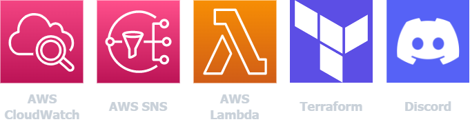
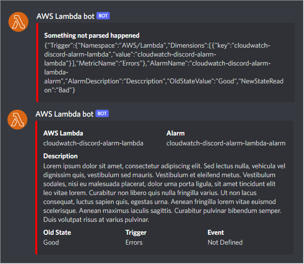

  Discord Cloud Alarm is a project to help developers monitors their applications through discord chat platform without the need to be constantly be watching AWS metrics. :jigsaw: 

 

  

  Discord Cloud Alarm uses bleeding edge technologies, as Lambda Layers, Terraform and SWC, focusing on speed, lightweighting and reproducibility. :rocket:

 

  

## Index
- [Getting Started][100]
- [Running the app][101]
- [Contact][102]
- [Notes][103]

[100]: #getting-started
[101]: #running-the-app
[102]: #contact
[103]: #notes

## Getting Started
To start using Discord Cloud Alarm project you will need to install some tools and create accounts.

1. Install [Node.js](https://nodejs.org/en/).
2. Create an [AWS account](https://aws.amazon.com/).
3. Install [AWS CLI](https://aws.amazon.com/cli).
4. Install [Terraform](https://www.terraform.io/downloads).
5. Install a code editor of your choice, as [VSCode][201].
6. Install and create a [Discord account](https://discord.com/).
7. Configure your aws cli and terraform cli.

[201]: https://code.visualstudio.com/

Now you're ready to run Discord Cloud Alarm. :rocket:

## Running the app

### Core
1. Go to `<root>/layers/dotenv/nodejs` directory.
2. Run `npm install` to install all dependencies.
3. Repeat the process above to `<root>/layers/got/nodejs` and `<root>/layers/regenerator-runtime/nodejs` directories.
4. Go to `<root>/lambdas/cloudwatch-discord-alarm` directory.
5. Copy the `.env.example` file on the root of this folder with the name `.env`
6. Fill all variables lines with your respective configuration. 
   1. Don't forget, those values change based on your discord webhook.
7. Run `npm run install` to install all dependecies.
8. Run `npm run build` to build your application.
   1. You can r.
      1. In the .spec file you can find a mockup of the event and context the lambda handler will be executed with.
9. Go to `<root>/.infra` directory.
10. Run `terraform validate` to verify if the terraform syntax is correct.
11. Run `terraform plan` to view all the changes that will be made to your AWS infraestructure.
12. Run `terraform apply` to deploy to production.

### Testing
Those steps are independents, you can do whatever you like.

- Run `npm test` on `<root>/lambdas/cloudwatch-discord-alarm` directory to verify if the typescript code is working properly.
- Run `aws cloudwatch set-alarm-state --alarm-name "cloudwatch-discord-alarm-lambda-alarm" --state-reason "Testing the Amazon Cloudwatch alarm" --state-value ALARM` to force the cloudwatch state to change to `ALARM` and trigger the SNS event to call the lambda function and send you a discord message! use this to verify if everything is working properly!

### Development
You may want to change something on the project code and to do some you'll have to make some tweaks to the `index.ts` file using the `index.spec.ts` file as a reference, them run `npm run dev`.

## Contact
If you want, for any reason, to contact me, you can reach me at [fmaiasr.dev@gmail.com][400]. :email:

[400]: mailto:fmaiasr.dev@gmail.com?subject=Discord%20Cloud%20Alarm%20Github%20Project

## Notes
- Discord Cloud Alarm is a project based on multiple researches, documentations and trial and error.
- Due to an [issue with swc (2022/07/06)][500] I had to use an workaround proproused by another developer to avoid compiling the .spec file and deploy it to production.
- This project focus on problem solving, practicing and exibithing all the knowledge I gathered through work, courses, guides and others projects across the years.
- Last feature update commit: 2022/07/06
  
[500]: https://github.com/swc-project/jest/issues/62
